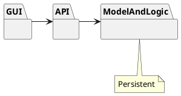

# Design Document 

Authors:
	Antonio Vespa s284101
	Pietro Borgaro s292501
	Giulio Corallo s282380

Date: 31/05/2021

Version: 1
=======


# Contents

- [High level design](#package-diagram)
- [Low level design](#class-diagram)
- [Verification traceability matrix](#verification-traceability-matrix)
- [Verification sequence diagrams](#verification-sequence-diagrams)

# Instructions

The design must satisfy the Official Requirements document, notably functional and non functional requirements

# High level design 

It is a standalone application model (see requirements) which runs on PCs.

Architectural pattern used: MVC, commonly used for developing user interfaces that divides the related program logic into three interconnected elements. This is done to separate internal representations of information from the ways information is presented to and accepted from the user.

Layered style: presentation (GUI), application logic and data layer. GUI interacts through API with ModelAndLogic package.




# Low level design

```plantuml
@startuml
scale 0.5

package EZShop.ModelAndLogic{
class EZShop{
-loggedUser: User
+recoverBalanceOperation(balanceID,typeOp,money,date,time,status): boolean
+recoverSale(ticketNumber,discountRate,price,pointsEarned,status): boolean
+recoverTicket(ticketNumber,barCode,description,amount,pricePerUnit,total,discountRate,amountReturned):boolean
+updateDbProducts(): void
+updateDbCustomers(): void
+updateDbUsers(): void
+updateDbOrders(): void
+updateDbSales(sale): void
+updateDbEntry(entry,saleID): void
+updateDbEntries(sale): void
+updateDbOperations(): void
+reset(): void 
+createUser(username,password,role): Integer 
+deleteUser(id): boolean 
+getAllUsers(): List<User>
+getUser(id): User 
+updateUserRights(id,role): boolean
+login(username,password): User
+logout(): boolean
+createProductType(description, productCode, pricePerUnit, note): Integer 
+updateProduct(id, newDescription, newCode, newPrice, newNote): boolean
+deleteProductType(id): boolean 
+getAllProductTypes(): List<ProductType>
+getProductTypeByBarCode(barCode): ProductType 
+getProductTypesByDescription(description): List<ProductType>
+updateQuantity(productId, toBeAdded): boolean 
+updatePosition(productId, newPos): boolean 
+recoverOrder(orderID,productCode,pricePerUnit,quantity,status): boolean
+issueOrder(productCode, quantity, pricePerUnit): Integer 
+payOrderFor(productCode, quantity, pricePerUnit): Integer 
+payOrder(orderId): boolean
+recordOrderArrival(orderId): boolean
+getAllOrders(): List<Order>
+defineCustomer(customerName): Integer 
+modifyCustomer(id, newCustomerName, newCustomerCard): boolean 
+deleteCustomer(id): boolean 
+getCustomer(id): Customer 
+getAllCustomers(): Customer 
+createCard(): String 
+attachCardToCustomer(customerCard, customerId): boolean 
+modifyPointsOnCard(customerCard, pointsToBeAdded): boolean 
+startSaleTransaction(): Integer 
+addProductToSale(transactionId, productCode, amount): boolean 
+deleteProductFromSale(transactionId, productCode, amount): boolean 
+applyDiscountRateToProduct(transactionId, productCode,  discountRate): boolean 
+applyDiscountRateToSale(transactionId, discountRate): boolean 
+computePointsForSale(transactionId): int 
+endSaleTransaction(transactionId): boolean 
+deleteSaleTransaction(transactionId): boolean
+getSaleTransaction(transactionId): SaleTransaction  
+startReturnTransaction(transactionId): Integer  
+returnProduct(returnId, productCode, amount): boolean
+endReturnTransaction(returnId, commit): boolean
+deleteReturnTransaction(returnId): boolean
+receiveCashPayment(transactionId, cash): double
+checkCreditCardLunh(creditCardNumber): boolean
+receiveCreditCardPayment(transactionId, creditCard): boolean
+returnCashPayment(returnId): double
+returnCreditCardPayment(returnId, creditCard): double 
+recordBalanceUpdate(toBeAdded): boolean
+getCreditsAndDebits(LocalDate from, LocalDate to): List<BalanceOperation> 
+computeBalance(): double
}
EZShop-->Database
EZShop -up-> Employees
EZShop -->"*" CreditCard
Note "HashMap<String creditCard,CreditCard card>" as N11
(EZShop ,CreditCard) .. N11

class Database{
-running: boolean
-maxCounterOperations: Integer
+destroyEntries(): void
+createTableEntries(): void
+clearTableEntries(): void
+clearEntry(MyTicketEntry t,Integer ticketNumber): boolean
+addEntry(MyTicketEntry t,Integer ticketNumber): boolean 
+createTableSales(): void
+destroySales(): void
+clearTableSales(): void
+addSale(MySaleTransaction op): boolean
+createTableOperations(): void
+destroyOperations(): void
+clearTableOperations(): void
+addOperation(MyBalanceOperation op): void
+createTableOrders(): void
+destroyOrders(): void
+clearTableOrders(): void
+addOrder(MyOrder op): void
+createTableProducts(): void
+destroyProducts(): void
+clearTableProducts(): void
+addProduct(Integer productID, String barCode, String description, Double sellPrice, String notes,Integer quantity, String position): void
+createTableEmployees(): void
+destroyEmployees(): void
+clearTableEmployees(): void
+addUser(Integer userID, String name, String password, String role): void
+createTableCustomers(): void
+destroyCustomers(): void
+clearTableCustomers(): void
+addCustomer(Integer customerID, String name, String lcardID, Integer lcardPoints): void
}
Database-->EZShop

class Employees{
-HashMap<String username,Integer userid> usersNameID
+deleteUser(id): boolean
+getAllUsers(): List<User>
+getUser(id): User
+addUser(): Integer
+searchUser(username): User
}

class EmployeesCounter{
-counter: Integer
+add(): void
+sub(): void
+getCounter(): Integer
+setCounter(counter): void
}
Employees -->  EmployeesCounter
Employees --> "*" MyUser 
Note "HashMap<Integer userID, MyUser user>" as N1
(Employees,MyUser) .. N1

class MyUser{
-userID: Integer
-role: String
-username: String
-password: String
+verifyAutentication(password): boolean
}

EZShop -left-> AccountBook

EZShop --> CustomerList
class CustomerList{
-HashMap<String customer,Integer customerID> customersID
+getCustomer(id): MyCustomer
+getAllCustomers(): List<Customer>
+modifyCustomer(newCustomerName,newCustomerCard): boolean
+modifyCustomerName(id,name): boolean
+searchCardOwner(card): String
+updatePoints(card,points): boolean
+addCustomer(customerName): Integer
+deleteCustomer(id): boolean
+getCustomerName(id): String
+searchCustomer(name): MyCustomer
}

CustomerList-->"*"MyCustomer
Note "HashMap<Integer customerID, MyCustomer cust>" as N2
(CustomerList,MyCustomer) .. N2

class MyCustomer{
-name: String
-custumerId: Integer
-lcardID: String
-lcardPoints: Integer
+addPoints(points): boolean
}
CustomerList-->CustomerCounter
class CustomerCounter{
-counter: Integer
+add()
+sub()
+getCounter(): Integer
+setCounter(counter): void
}
EZShop-->CardCounter
class CardCounter{
-counter: String
+add()
+sub()
+getCounter(): String
+setCounter(counter): void
}

class Catalogue{
+getAllProductTypes(): List<ProductType>
+getProductTypesByDescription(description): List<ProductType>
+getProductTypeByBarCode(barCode): ProductType
+deleteProductType(id): boolean
+addProductType(description,productCode,pricePerUnit,note): Integer
+getProductTypeById(id): MyProductType 
+checkPosition(position): boolean
+checkBarCode(productCode): boolean
}
Catalogue-->ProductCounter

class ProductCounter{
-counter: Integer
+add()
+sub()
+getCounter(): Integer
+setCounter(counter): void
}
EZShop-up->Catalogue
Catalogue-->"*"MyProductType
Note "HashMap<Integer ProductId,MyProductType pt>" as N3
(Catalogue,MyProductType) .. N3

class MyProductType{
-productID: Integer
-barCode: String 
-description: String
-sellPrice: double
-quantity: Integer
-notes: String 
+updateQuantity(toBeAdded): boolean 
+updatePosition(newPos): boolean 
}

MyProductType --> Position
class Position{
-aisleID: String
-rackID: String
-levelID: String
-location: String
}

class AccountBook{
-Balance: double
+issueOrder(productCode,quantity,pricePerUnit): Integer
+recoverOrder(orderID,productCode,pricePerUnit,quantity,status): boolean
+payOrderFor(productCode,quantity,pricePerUnit): Integer
+payOrder(orderId): boolean
+recordOrderArrival(id): boolean
+getAllOrders(): List<Order>
+getAllSales(): List<SaleTransaction> 
+getOrderById(orderId): MyOrder
+searchBalanceOperation(id): BalanceOperation
+getBalanceOperationByDate(LocalDate from, LocalDate to): List<BalanceOperation> 
+issueSaleTransaction(): Integer
+addOrRemoveProductToSale(transactionId,productCode,amount, type,pricePerUnit,description): boolean
+recoverBalanceOperation(balanceID,typeOp,money,date,time,stat): boolean
+addNewBalanceOperationSale(sale): MyBalanceOperation
+removeSaleTransaction(transactionId,catalogue): boolean
+recoverSale(ticketNumber,discountRate,price,pointsEarned,status): boolean
+recoverTicket(ticketNumber,barCode,description,amount,pricePerUnit,total,discountRate,amountReturned): boolean
+issueReturnTransaction(sale): Integer
+getReturnTransactionById(returnId): MyReturnTransaction
+removeReturnTransaction(returnId): boolean
+addNewBalanceOperationReturn(return): MyBalanceOperation
+recordBalanceUpdate(value,type): boolean
+addReturnTransaction(returnId,balanceOp): boolean
+computeBalance(): double
+removeBalanceOperation(id): boolean
}

class MyOrder{
-orderID: Integer
-balanceID: Integer
-productCode: String
-status: String
-pricePerUnit: Double
-quantity: int
}
 
AccountBook -->"*" MyBalanceOperation
Note "HashMap<Integer BalanceID,BalanceOperation bp>" as N4
(AccountBook ,MyBalanceOperation) .. N4
AccountBook -->"*" MyOrder
Note "HashMap<Integer orderID,MyOrder ord>" as N8
(AccountBook ,MyOrder) .. N8
AccountBook -->"*" MySaleTransaction
Note "HashMap<Integer saleID,MySaleTransaction sale>" as N9
(AccountBook ,MySaleTransaction) .. N9
AccountBook -->"*" MyReturnTransaction
Note "HashMap<Integer returnID,MyReturnTransaction ret>" as N10
(AccountBook ,MyReturnTransaction) .. N10

class MyBalanceOperation{
-money:Double
-balanceID: Integer
-date: LocalDate
-time: String
-typeOp: Integer
-status: String
+getTotalPrice(): double
+startPayment(String creditCard,double amount): boolean
+startPayment(double price,double cash): boolean
+getReturnValue(): double
}


class Payment{
-price: double
-returnPrice: double
-cashOrCard: double
-committed: boolean
-paymentID: Integer
+computeChange(): double
}

class CreditCard{
-creditCardNumber: String
-balance: double
checkBalance(price): boolean
}
class PaymentCounter{
-counter: Integer
+add(): Integer
+sub()
}
Payment --> CreditCard
MyBalanceOperation --> PaymentCounter
MyBalanceOperation --> Payment 


class MySaleTransaction{
-ticketNumber: Integer
-price: double
-discountRate: double
-pointsEarned: int
-status: String
-dbUpdating: boolean
+addProductToSale(productCode, amount,pricePerUnit,description): boolean
+removeProductFromSale(productCode, amount): boolean
+addDiscountToProduct(productCode,discount): boolean
+computeTotalPrice(): double
+computePointsEarned(): void
+removeAllProductsFromSale(catalogue): boolean
+getTicketEntry(productCode): MyTicketEntry
+getEntries(): List<TicketEntry>
+setEntries(entries): void 
}
MySaleTransaction-->"*" MyTicketEntry 
Note "Map<String productCode,TicketEntry te>" as N7
(MySaleTransaction,MyTicketEntry) .. N7

class MyTicketEntry{
-barCode: String
-description: String
-amount: int
-pricePerUnit: double
-discountRate: double
-total: double
-amountReturned: int
+computeTotal(): void
+updateAmountReturned(amount): void
}
MyReturnTransaction-->MySaleTransaction

class MyReturnTransaction{
-HashMap<String productCode,Integer amount> returnedPerBarcode
-saleID: Integer
-returnID: Integer
-status: String
+returnProduct(productCode,amount): boolean
+commit(catalogue): boolean
+computeTotalPrice(): double
}




}

@enduml
```




# Verification traceability matrix


# Verification sequence diagrams 

##Use Case 1
#Scenario 1.1
```plantuml
actor Administrator

Administrator -> EZShop : createProductType()
EZShop -> Catalogue : getProductTypeByBarCode()
Catalogue --> EZShop : return ProductType
EZShop -> Catalogue : addProductType()
Catalogue -> ProductCounter : add()
Catalogue -> ProductCounter : getCounter()
ProductCounter --> Catalogue : return counter
Catalogue -> MyProductType : MyProductType()
Catalogue --> EZShop : return productID
EZShop -> DataBase : update()
DataBase --> EZShop : return result
EZShop --> Administrator : return productID
Administrator -> EZShop : updatePosition()
EZShop -> Catalogue : getProductTypeById()
Catalogue --> EZShop : return MyProductType
EZShop -> Catalogue : checkPosition()
Catalogue --> EZShop : return result
EZShop -> MyProductType : setLocation()
EZShop -> DataBase : update()
DataBase --> EZShop : return result
EZShop --> Administrator : Success message


@enduml

```

##Use Case 2
#Scenario 2.1
```plantuml
actor Administrator

Administrator -> EZShop : createUser()
EZShop -> Employees : addUser()
Employees -> EmployeesCounter : add()
Employees -> EmployeesCounter : getCounter()
EmployeesCounter --> Employees : return counter
Employees -> MyUser : MyUser()
Employees --> EZShop : return userId
EZShop -> DataBase : update()
DataBase --> EZShop : return result
EZShop --> Administrator : return userId


```

##Use Case 3
#Scenario 3.1
```plantuml
actor ShopManager

ShopManager -> EZShop : issueOrder()
EZShop -> Catalogue : getProductTypeByBarCode()
Catalogue --> EZShop : return ProductType
EZShop -> AccountBook : issueOrder() 
AccountBook -> OperationsCounter : add()
AccountBook -> OperationsCounter : getCounter()
OperationsCounter --> AccountBook : return counter
AccountBook -> MyOrder : MyOrder()
AccountBook -> MyOrder : setStatus()
AccountBook --> EZShop : return orderID
EZShop -> DataBase : update()
DataBase --> EZShop : return result
EZShop --> ShopManager : return orderID


```

##Use Case 4
#Scenario 4.1
```plantuml
actor User

User -> EZShop : defineCustomer()
EZShop -> CustomerList : addCustomer()
CustomerList -> CustomerCounter : add()
CustomerList -> CustomerCounter : getCounter()
CustomerCounter --> CustomerList : return counter
CustomerList -> MyCustomer : MyCustomer()
CustomerList --> EZShop : return customerId
EZShop -> DataBase : update()
DataBase --> EZShop : return result
EZShop --> User : return customerId


```

##Use Case 5
#Scenario 5.1
```plantuml
actor User

User -> EZShop : login()
EZShop -> Employees : searchUser()
Employees -> MyUser : verifyAutentication()
MyUser --> Employees : return result
Employees --> EZShop : return MyUser
EZShop --> User : return User


```

##Use Case 6
#Scenario 6.1
```plantuml
actor Cashier

Cashier ->EZShop : startSaleTransaction()
EZShop -> AccountBook : issueSaleTransaction()
AccountBook -> OperationsCounter : addCounter()
AccountBook -> OperationsCounter : getCounter()
AccountBook -> MySaleTransaction : MySaleTransaction()
AccountBook --> EZShop : return saleID
EZShop --> Cashier : return saleID
Cashier -> EZShop : addProductToSale()
EZShop -> Catalogue : getProductTypeByBarCode()
Catalogue --> EZShop : return productType
EZShop ->MyProductType : updateQuantity()
EZShop -> AccountBook : addOrRemoveProductToSale()
AccountBook -> MySaleTransaction : addProductToSale()
MySaleTransaction -> MyTicketEntry : MyTicketEntry()
MySaleTransaction -> MyTicketEntry : setAmount()
MySaleTransaction --> EZShop : return result
EZShop --> Cashier : return result
Cashier -> EZShop : endSaleTransaction()
EZShop -> AccountBook : getSaleTransactionById()
EZShop --> Cashier : return result
Cashier -> EZShop : endSaleTransaction()
EZShop --> Cashier : return result
Cashier -> EZShop : receiveCreditCardPayment() see UC7
EZShop --> Cashier : return result

```

##Use Case 7
#Scenario 7.1
```plantuml
actor Cashier

Cashier -> EZShop : receiveCreditCardPayment()
EZShop -> AccountBook : getSaleTransaction()
AccountBook --> EZShop : return SaleTransaction
EZShop -> MySaleTransaction : computeTotalPrice()
EZShop -> AccountBook : addNewBalanceOperationSale()
EZShop -> MyBalanceOperation : startPayment()
MyBalanceOperation -> PaymentCounter: add()
MyBalanceOperation -> PaymentCounter: getCounter()
MyBalanceOperation -> Payment: Payment()
MyBalanceOperation -> Payment: computeChange()
Payment --> MyBalanceOperation : return change
MyBalanceOperation --> EZShop: return change
EZShop -> MySaleTransaction : setStatus()
EZShop -> MyBalanceOperation : setStatus()
EZShop -> AccountBook : recordBalanceUpdate()
EZShop --> Database : update()
Database --> EZShop : return result
EZShop --> Cashier : return result


```

##Use Case 8
#Scenario 8.1
```plantuml
actor Cashier

Cashier -> EZShop : startReturnTransaction()
EZShop -> AccountBook : getSaleTransactionById()
AccountBook --> EZShop : return MySaleTransaction
EZShop -> AccountBook : issueReturnTransaction()
AccountBook -> OperationsCounter : add()
AccountBook -> OperationsCounter : getCounter()
AccountBook -> MyReturnTransaction : MyReturnTransaction()
AccountBook -> MyReturnTransaction : setStatus()
AccountBook --> EZShop : returnTransactionId
EZShop --> Cashier : return returnTransactionId 
Cashier -> EZShop : returnProduct()
EZShop -> AccountBook : getReturnTransactionById()
AccountBook --> EZShop : return MyReturnTransaction
EZShop -> Catalogue : getProductTypeByBarCode()
Catalogue --> EZShop : return productType
EZShop -> MyReturnTransaction : returnProduct()
MyReturnTransaction -> MySaleTransaction : getTicketEntry()
MySaleTransaction --> MyReturnTransaction : return MyTicketEntry
MyReturnTransaction --> EZShop : return result
EZShop --> Cashier : return result
Cashier -> EZShop : returnCreditCardPayment() see UC10
EZShop --> Cashier : return result

```

##Use Case 9
#Scenario 9.1
```plantuml
actor Administrator

Administrator -> EZShop : getCreditsAndDebits()
EZShop -> AccountBook : getBalanceOperationByDate()
AccountBook --> EZShop : return transactionList
EZShop --> Administrator : return transactionList

```

##Use Case 10
#Scenario 10.1
```plantuml
actor Administrator

Administrator -> EZShop : returnCreditCardPayment()
EZShop -> CreditCard : get()
CreditCard --> EZShop : return cc
EZShop -> AccountBook : getReturnTransactionById()
AccountBook --> EZShop : return MyReturnTransaction
EZShop -> MyReturnTransaction : computeTotalPrice()
MyReturnTransaction -> MySaleTransaction : getEntries()
MySaleTransaction --> MyReturnTransaction : return entries
MyReturnTransaction -> MySaleTransaction : getDiscountRate()
MySaleTransaction --> MyReturnTransaction : return discountRate
MyReturnTransaction --> EZShop : return totalPrice
EZShop -> AccountBook : addNewBalanceOperationReturn()
AccountBook -> MyBalanceOperation : MyBalanceOperation()
AccountBook -> MyBalanceOperation : setStatus()
AccountBook --> EZShop : return MyBalanceOperation
EZShop -> MyBalanceOperation : setMoney()
EZShop -> MyBalanceOperation : startPayment()
MyBalanceOperation -> PaymentCounter : add()
MyBalanceOperation -> PaymentCounter : getCounter()
MyBalanceOperation -> Payment : Payment()
MyBalanceOperation --> EZShop : return result
EZShop -> AccountBook : recordBalanceUpdate()
AccountBook --> EZShop : return result
EZShop -> MyReturnTransaction : setStatus()
EZShop -> MyBalanceOperation : setStatus()
EZShop -> Database : update()
Database --> EZShop : return result
EZShop --> Administrator : return result


```

